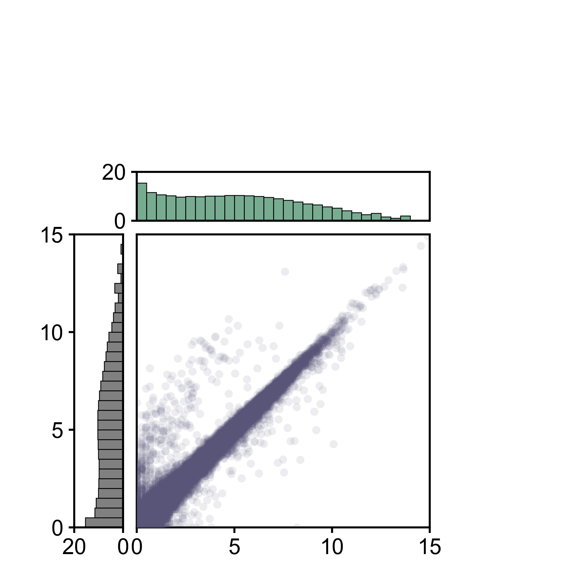
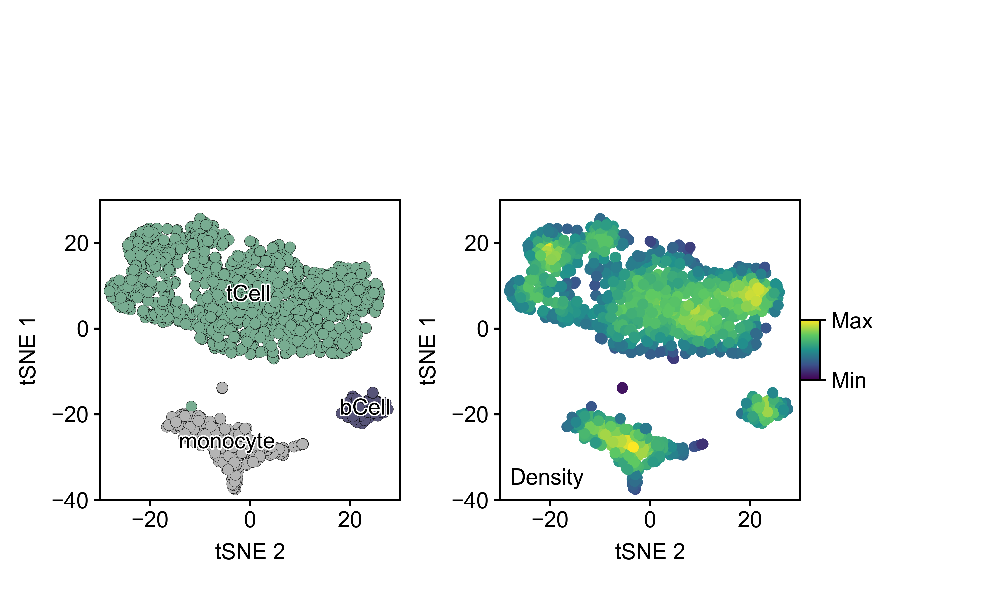
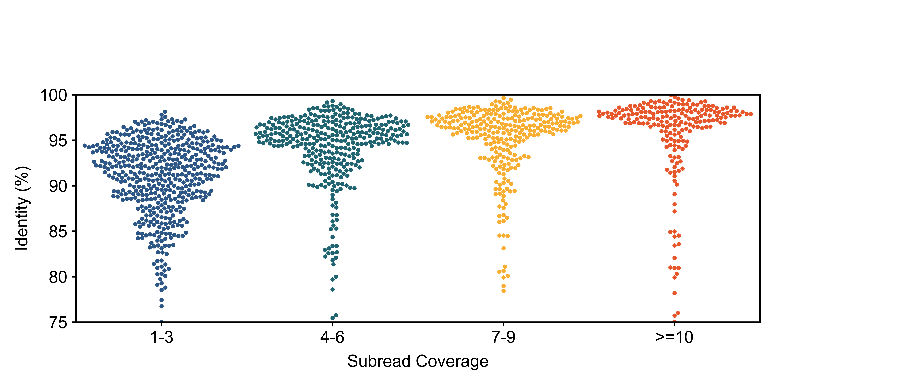

# BME163: Applied Visualization and Analysis of Scientific Data

This repository contains code, assignments, and visualizations developed for **BME163**, a course taught by **Professor Christopher Vollmers** at UC Santa Cruz. The course focuses on the use of **Python**, **Matplotlib**, and **Linux-based tools** to analyze scientific data and produce high-quality visual representations.

## 📌 Course Objectives

Using Python/Matplotlib, students learn to:

- Parse biological data from text files with varying formats
- Apply non-parametric and permutation-based statistical tests
- Generate publication-quality, multi-panel scientific figures
- Use built-in Matplotlib functions for standard visualizations
- Design and implement customized plotting functions

## 🧰 Tools & Technologies
- Python 3.x
- Matplotlib
- NumPy
- Linux command-line tools

---

## 📂 Assignments

| Assignment | Description | Preview |
|------------|-------------|---------|
| [Week 1](Assignment_Week1/) | Custom RGB gradients using viridis and plasma colormaps with rectangles and diagonal line |  |
| [Week 2](Assignment_Week2/) | Scatter plot of biological reads with log-transformed histograms |  |
| [Week 3](Assignment_Week3/) | tSNE plot of immune cell clusters and density-based heatmap using custom colormaps |  |
| [Week 4](Assignment_Week4/) | Swarm plot of read identity (%) binned by subread coverage using customized jittering and color coding |  |
| [Week X](Assignment_WeekX/) | *Customize this for your next task* | *[image]* |

> ✨ *Each figure is designed for clarity, reproducibility, and publication quality.*

---

## 🧪 Topics Covered
- Genomic data parsing and visualization
- Swarm plots, boxplots, and statistical overlays
- Custom figure layout and styling using `.mplstyle`
- Multi-panel composition and formatting

---

## 🧵 How to Reproduce
To run a specific assignment:
```bash
python3 Wang_Karen_BME163_Assignment_Week4.py -i input_data.ident -c input_data.cov -o output_figure.png
